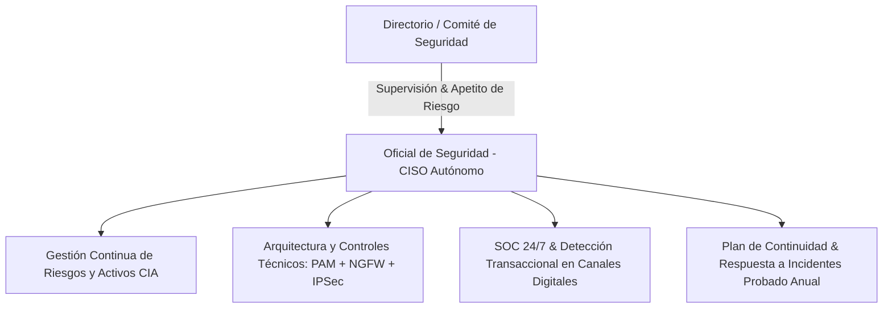

# EXECUTIVE SUMMARY & STRATEGIC GOVERNANCE
## Network Security, Identity Assurance & Regulatory Compliance (MBA / Tech Leadership)

> **Target Audience:** Chief Information Security Officer (CISO), Chief Technology Officer (CTO), Head of Enterprise Architecture, Board Risk Committee.

---

## 1. STRATEGIC EXECUTIVE ALIGNMENT & RISK POSTURE

Modern digital enterprises operate in an environment characterized by sophisticated asymmetric threats (Ransomware-as-a-Service, supply-chain attacks, advanced credential stuffing, and APTs). Information security is no longer an isolated IT operational function; it is a **core driver of business continuity, enterprise valuation, and regulatory license to operate**.

$$\text{Valor Empresarial Protegido} = \text{Continuidad de Negocio} \times (1 - \text{Probabilidad de Brecha}) - \text{Costo Total de Cumplimiento (TCO)}$$

### Key Strategic Objectives:
1. **Zero-Trust Identity Governance:** Decouple and strictly verify identity, authentication, and federation per **NIST SP 800-63-3**.
2. **Regulatory Adherence & Capital Protection:** 100% compliance with financial directives (**Resolución SBS N° 504-2021**), mitigating sanctions and operational risk reserves.
3. **Privileged Access Management (PAM) & Zero Implicit Trust:** Elimination of shared root/admin credentials via granular, auditable AAA architectures (**RFC 8907 TACACS+ & RFC 2865 RADIUS**).
4. **Engineering Talent Optimization (Polyglot Synergies):** Standardizing on high-leverage top-tier stacks (**TypeScript, Python, and Go**) to optimize time-to-market and resilience.

---

## 2. COMPARATIVE TCO & ARCHITECTURAL DECISION MATRIX

| Architecture Dimension | Legacy Fragmented Approach | Enterprise Zero-Trust AAA + NIST 800-63 | Strategic Business Benefit |
| :--- | :--- | :--- | :--- |
| **Identity Verification** | Siloed local accounts / Periodic password resets | Federated SSO (OIDC/SAML) + FIDO2 Phishing-Resistant MFA (AAL3) | **99.9% reduction in account takeover (ATO) risk**; reduced IT helpdesk password reset overhead by 70%. |
| **Perimeter & LAN Defense** | Basic stateless packet filtering | Next-Gen Firewalls (DPI) + Dynamic ARP Inspection (DAI) + DHCP Snooping | Elimination of lateral movement and MITM eavesdropping within data centers. |
| **Regulatory Compliance** | Manual, reactive audit preparation | Automated continuous telemetry (SIEM/SOC 24/7) aligned with SBS 504-2021 | Immediate audit readiness, zero regulatory penalty exposure. |
| **Engineering Stacks** | Unstructured scripts in disparate languages | Strict TypeScript domain models, Python SecOps automation, Go micro-proxies | **40% faster onboarding**, standardized enterprise maintainability and high throughput. |

---

## 3. REGULATORY COMPLIANCE ROADMAP: RESOLUCIÓN SBS N° 504-2021

### Mandated Compliance Milestones:
- **Governance Independence:** Formal reporting line of the CISO directly to the Board/Executive Risk Committee (Independent of IT Operations).
- **Phishing-Resistant MFA in Critical Channels:** Deployment of hardware cryptographic tokens (FIDO2/WebAuthn) for high-risk financial authorization.
- **Continuous Penetration Testing:** Annual Red Team engagements and mandatory pre-production assessments for all new digital banking releases.

---

## 4. POLYGLOT ENGINEERING STRATEGY FOR HIGH-PERFORMING TEAMS

Top-tier engineering organizations (Google, Cloudflare, Stripe, Meta) avoid monolithic single-language rigidity by strategically aligning language strengths to functional domains:

1. **TypeScript 5.7+ (Enterprise Applications & Identity SDKs):**
   - *Rationale:* Type safety, rich ecosystem, schema validation (Zod), and universal browser/server ergonomics.
2. **Python 3.12+ (SecOps Automation & Threat Intelligence):**
   - *Rationale:* Unrivaled speed of iteration for network device provisioning (Netmiko), packet inspection (Scapy), and AI-driven log anomaly detection.
3. **Go 1.23+ (High-Throughput Infrastructure & Zero-Trust Proxies):**
   - *Rationale:* Ultra-fast concurrency (Goroutines), minimal memory footprint, single static binary deployments, and first-class networking primitives for low-latency UDP/TCP proxies.
