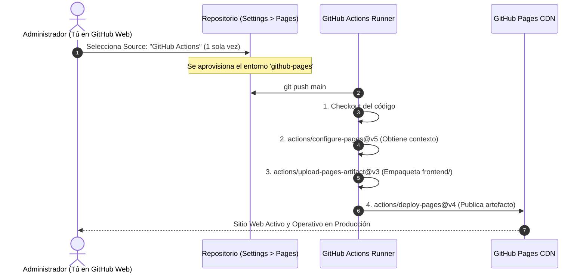

# GUÍA DE RESOLUCIÓN DE ERRORES Y DIAGNÓSTICO CI/CD (TROUBLESHOOTING)
## Despliegue en GitHub Pages y GitHub Actions Runners

> **Objetivo:** Este documento documenta y explica con rigor técnico y didáctico los errores más comunes de integración continua (CI/CD) y despliegue en GitHub Pages, sus causas raíz en la arquitectura de permisos de GitHub y cómo resolverlos paso a paso para desarrolladores nuevos y futuros mantenedores.

---

## 📑 ÍNDICE DE ERRORES FRECUENTES

1. [Error 1: Get Pages site failed - 404 Not Found](#error-1)
2. [Error 2: Create Pages site failed - 403 Resource not accessible by integration](#error-2)
3. [Advertencia 3: Node 20 is being deprecated / Running with Node 24](#advertencia-3)
4. [Diagrama del Ciclo de Despliegue Seguro de GitHub Pages](#ciclo-despliegue)
5. [Checklist de Verificación Rápida](#checklist)

---

<a name="error-1"></a>
## 🔴 ERROR 1: `Get Pages site failed. Error: Not Found - 404`

### Mensaje de Error en el Log:
```text
Run actions/configure-pages@v5
Warning: Get Pages site failed. Error: Not Found - https://docs.github.com/rest/pages/pages#get-a-apiname-pages-site
Error: HttpError: Not Found
```

### ¿Por qué ocurre? (Causa Raíz Arquitectónica)
- Por defecto, en todo nuevo repositorio de GitHub, **el servicio de GitHub Pages se encuentra desactivado** o configurado en el modo tradicional *"Deploy from a branch"*.
- Cuando la acción `actions/configure-pages@v5` se ejecuta por primera vez, realiza una petición `GET /repos/{owner}/{repo}/pages` a la API REST de GitHub para consultar la URL y estado del sitio.
- Al no haber sido inicializado el entorno de Pages por el administrador del repositorio, la API de GitHub responde con el código de estado HTTP `404 Not Found`.

### Solución Paso a Paso (1 Solo Clic en GitHub UI):
1. Ingresa a tu repositorio en GitHub.
2. Ve a la pestaña **Settings** (Configuración superior).
3. En el menú lateral izquierdo, haz clic en **Pages** (en la sección *Code and automation*).
4. En **Build and deployment**:
   - En el menú desplegable **Source**, cambia de *"Deploy from a branch"* a:  
     👉 **GitHub Actions**
5. Al hacer este cambio, GitHub registra internamente el entorno `github-pages` en su base de datos.
6. En la pestaña **Actions**, haz clic en **Re-run all jobs** (o realiza un nuevo push). El workflow avanzará sin errores.

---

<a name="error-2"></a>
## 🔴 ERROR 2: `Create Pages site failed - 403 Resource not accessible by integration`

### Mensaje de Error en el Log:
```text
Error: Create Pages site failed. Error: Resource not accessible by integration - https://docs.github.com/rest/pages/pages#create-a-apiname-pages-site
Error: HttpError: Resource not accessible by integration
```

### ¿Por qué ocurre? (Causa Raíz de Seguridad)
- Ocurre cuando se añade el parámetro `enablement: true` dentro del workflow de GitHub Actions.
- El token estándar provisto por GitHub a los flujos de trabajo (`GITHUB_TOKEN`), por directivas de seguridad de mínimo privilegio (*Least Privilege Principle*), **NO tiene permisos de administración para crear o reconfigurar repositorios vía API**.
- Cuando el runner intenta ejecutar un `POST /repos/{owner}/{repo}/pages` para forzar la creación del sitio sin autorización de administrador, GitHub bloquea la petición con un error `403 Forbidden: Resource not accessible by integration`.

### Solución Técnica:
1. En el archivo de workflow `.github/workflows/deploy-pages.yml`, **NO se debe forzar el parámetro `enablement: true`**:
   ```yaml
   # Configuración Correcta y Segura:
   - name: Setup GitHub Pages
     uses: actions/configure-pages@v5
   ```
2. La activación inicial de GitHub Pages debe realizarse siempre **una sola vez desde la interfaz web de GitHub** (Settings > Pages > Source: GitHub Actions), donde el usuario autenticado cuenta con los privilegios de administrador requeridos.

---

<a name="advertencia-3"></a>
## 🟡 ADVERTENCIA 3: `Node 20 is being deprecated. This workflow is running with Node 24 by default`

### Mensaje en el Log:
```text
Node 20 is being deprecated. This workflow is running with Node 24 by default. 
If you need to temporarily use Node 20, you can set the ACTIONS_ALLOW_USE_UNSECURE_NODE_VERSION=true...
```

### ¿Por qué ocurre?
- **No es un error y no interrumpe el flujo de trabajo.**
- Es una advertencia informativa de la infraestructura de GitHub Actions (*Cloud Runners* en Ubuntu 24.04).
- GitHub está migrando el motor interno que ejecuta los scripts de las acciones de Node.js v20 (que entrará en fin de vida EOL) a Node.js v24.
- GitHub informa que ya está ejecutando la acción de forma segura sobre Node 24.

---

<a name="ciclo-despliegue"></a>
## 🔄 DIAGRAMA DEL CICLO DE DESPLIEGUE SEGURO



---

<a name="checklist"></a>
## ✅ CHECKLIST DE VERIFICACIÓN PARA NUEVOS REPOSITORIOS

- [x] **Frontend independiente:** Todo el código web está en `frontend/` con rutas relativas limpias.
- [x] **Permisos de GITHUB_TOKEN:** El archivo `.github/workflows/deploy-pages.yml` declara `pages: write` y `id-token: write`.
- [x] **Sin credenciales quemadas:** Cero llaves privadas, tokens o contraseñas en el historial de Git.
- [x] **Página de Pages configurada:** Pestaña *Settings* > *Pages* > *Source: GitHub Actions* activada.
- [x] **Quality Gates Aprobados:** Todos los tests pasan al 100% antes de desplegar.
